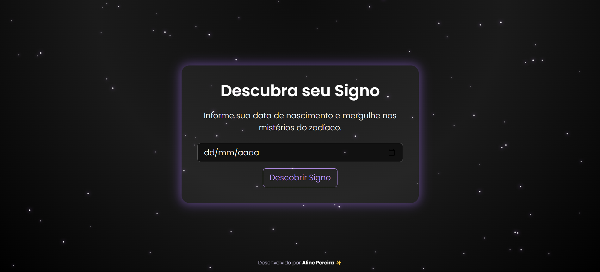

# 🌌 Zodiac – Calculadora de Signos do Zodíaco

<p align="center">
  
</p>


Aplicação web desenvolvida em PHP que identifica o signo do zodíaco com base na data de nascimento do usuário.


---
## 🌐 [Zodiac](https://zodiac-38d1.onrender.com/index.php)
---
## 🔧 Tecnologias utilizadas

- PHP 8.1
- HTML5 + CSS3
- Bootstrap 5
- JavaScript 
- XML 
- Docker

---
## 🖼️ Estrutura do projeto

```
├── index.php
├── show_zodiac_sign.php
├── signos.xml
├── layouts/
│   └── header.php
│   └── footer.php
├── assets/
│   ├── css/
│   │   └── style.css
│   ├── js/
│   │   └── stars.js
│   └── img/
│       └── [imagens dos signos]
├── Dockerfile
```

---


